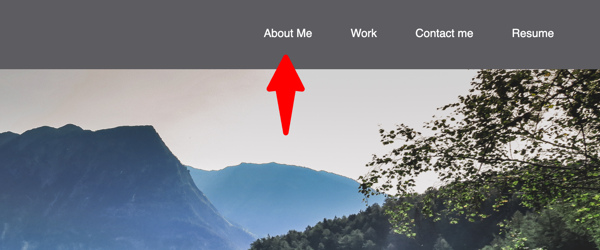
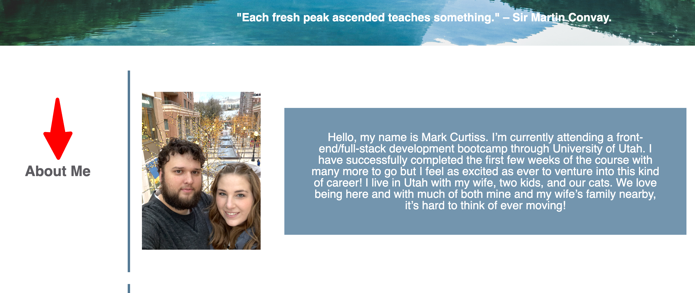
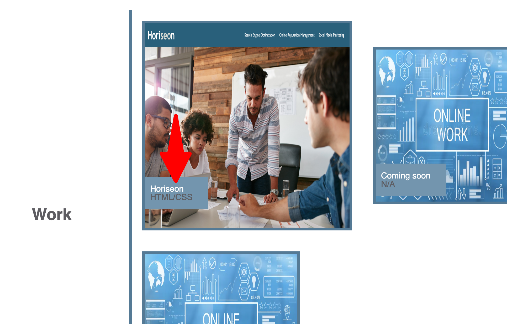

# portfolio-ver-1

## Description

A portfoio to house all my projects and show future employers what I am capable of. I built this to test my skills in html and css and to have a place to list any and all projects I've worked on. Future employers can view my work and see if my skills are what they are needing.

## Usage

When you select a link on the nav bar

it will jump you to that section on the web page.

selecting the name of the project in the work section

it will open in a new tab that particular project.

## License

Use license on github